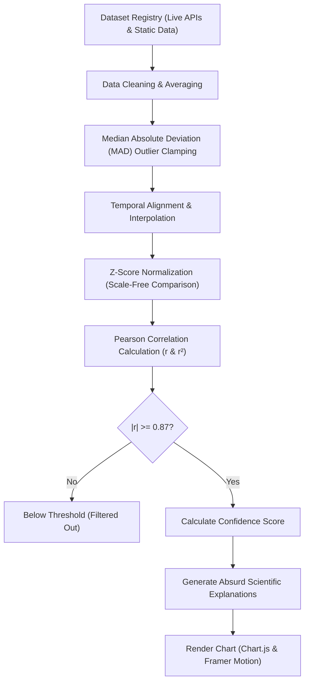

# Do They Talk? 📊🧠

**Do They Talk?** is a high-fidelity, premium interactive web application that exposes the humorous, baffling, and mathematically inevitable nature of **spurious correlations**. Built to explore time-series datasets from entirely unrelated domains, the application demonstrates a crucial statistical truth in a playful and engaging way:

> ⚠️ **Correlation does not equal causation.**

Just because two trends align perfectly on a chart with a high statistical confidence score does not mean there is a real-world cause-and-effect relationship between them.

* Live website: **[do-they-talk.pages.dev](https://0db48ab4.do-they-talk.pages.dev/)**
* Legacy worker version: **[do-they-talk.naishagajkandh.workers.dev](https://do-they-talk.naishagajkandh.workers.dev/)**

---

## 💡 Concept & Philosophy

> *"Can mathematics prove absolutely anything if we search hard enough for patterns? Or does it prove useless things?"*

In a world overflowing with numbers, trends, and statistics, unrelated things sometimes move together so perfectly that they almost feel connected. Shark attacks rise with ice cream sales. Cheese consumption mirrors bizarre accidents. Movie releases seem to predict completely unrelated events.

Most of these relationships are meaningless coincidences. But some discoveries in history also began as strange observations people almost ignored. This project was created to explore that thin line between coincidence and curiosity.

### The Story Behind the Logo
* **Two Things That Should Never Meet - But Do:** The logo features two distinct shapes facing each other: one round, one angular. Different by nature, different by design, built for entirely different purposes. In any logical world, they would never be in the same room. And yet, there is a pulse between them.
* **The Shapes Are the Data:** Every correlation on this website looks exactly like this. Ice cream sales and shark attacks. Nicolas Cage films and pool drownings. Two completely unrelated things, sitting across from each other—and somehow, impossibly, speaking on the same frequency. That light blue waveform between them is the correlation—the moment the data says something nobody asked it to.
* **Why That Matters:** Penicillin, Velcro, and X-rays were all accidents. The history of human invention is full of people who noticed something they were not supposed to notice—two unrelated things talking—and instead of walking away, they asked why. `DO THEY TALK` exists for that exact moment of curiosity. We are not here to prove these correlations mean something. We are here to make you wonder if they do. Because wondering is where everything begins.

---

## 🧠 Project Purpose & Motivation

This platform was developed **purely to inspire and improve Machine Learning and Data Science engineering skills**. 

Built by **Naisha Gajkandh** (an aspiring Data Science & ML Engineer), this codebase serves as a high-fidelity playground to master:
* Real-time client-side statistical modeling.
* Time-series temporal alignment and linear interpolation.
* Outlier detection and clamping using Median Absolute Deviation (MAD).
* Dimensionless, scale-free data visualization (Z-score normalization).
* High-performance client-side discovery engines (cross-category Pearson correlation search).

---

## ⚙️ How Everything Works

The application runs a lightweight, ML-style statistical pipeline directly in the user's browser, fetching data from live APIs and comparing time-series data using robust mathematical models.

### System Architecture & Data Pipeline


---

## 📈 Step-by-Step Data Processing Flow

### 1. Dataset Collection & Registry
The central entry point is the **Dataset Registry** (`src/data/registry.js`), which catalogues available datasets.
* **Live Datasets**: Fetched in real time from public APIs, including:
  * **World Bank API**: Population growth, GDP, CO2 emissions, tourism, forest coverage, R&D spending.
  * **Frankfurter API**: Live currency exchange rates (EUR to USD).
* **Static Datasets**: Extracted from historic databases, academic datasets, and Tyler Vigen's historical spurious correlation archives, including:
  * **CDC**: US divorce rates, pool drownings, sheet-entanglement fatalities.
  * **USDA**: US cheese and margarine consumption, honey yields.
  * **NASA CNEOS**: Near-Earth asteroid discoveries and aerospace launches.
  * **IMDb & Scripps**: Nicolas Cage movie releases and spelling bee winning word lengths.

---

### 2. Data Cleaning & Outlier Clamping
Raw data is often noisy, containing duplicates, missing years, or massive spikes. The pipeline sanitizes each series through the following operations:
* **Validation**: Drops invalid years (forcing values between 1900 and 2100) and filters out non-numeric values.
* **Averaging**: If a dataset contains duplicate values for a single year, the system calculates the mean value for that year.
* **Outlier Clamping (Median Absolute Deviation)**:
  To prevent anomalous single-year spikes (e.g., massive reporting glitches or sudden black swan events) from skewing the statistical correlation, the system uses a robust **Median Absolute Deviation (MAD)** method:
  
  $$\text{MAD} = \text{median}(|x_i - \tilde{x}|)$$
  
  Where $\tilde{x}$ is the median of the dataset. Any data point that lies further than $6 \times \text{MAD}$ from the median is clamped back to the limit boundary:
  
  $$\text{Limit} = \tilde{x} \pm (6 \times \text{MAD})$$

---

### 3. Temporal Alignment & Linear Interpolation
Datasets may cover completely different spans of years (e.g., World Bank GDP spans from 1960–2025, while Margarine consumption is recorded from 2000–2009).
* **Alignment**: The system calculates the exact intersection of years between Dataset A and Dataset B:
  
  $$\text{Intersection} = [\max(\text{start}_A, \text{start}_B), \min(\text{end}_A, \text{end}_B)]$$
  
* **Interpolation**: If there are small gaps inside the overlapping year range, the engine performs **linear interpolation** to reconstruct missing values:
  
  $$y = y_1 + (x - x_1) \frac{y_2 - y_1}{x_2 - x_1}$$

This guarantees perfectly matching annual pairs for calculation. If the resulting overlapping duration is **less than 6 years**, the pair is immediately discarded due to insufficient sample size.

---

### 4. Z-Score Normalization
Because we compare widely different units (e.g., *degrees Celsius* vs. *Nicolas Cage films* vs. *billion USD*), graphing them on the same axis directly is impossible. 

The system applies **Z-Score Normalization** to transform the raw values into standard deviations from their historical mean:

$$z_i = \frac{x_i - \mu}{\sigma}$$

Where:
* $\mu$ is the arithmetic mean: $\mu = \frac{1}{N} \sum_{i=1}^{N} x_i$
* $\sigma$ is the standard deviation: $\sigma = \sqrt{\frac{1}{N} \sum_{i=1}^{N} (x_i - \mu)^2}$

This scales all series to a dimensionless, scale-free shape, allowing the visualizer to map their shapes perfectly side-by-side on a dual-axis chart.

---

### 5. Pearson Correlation Coefficient ($r$)
Once normalized and aligned, the core engine calculates the **Pearson Correlation Coefficient ($r$)**:

$$r = \frac{\sum_{i=1}^{N} (z_{A,i} \cdot z_{B,i})}{N}$$

This outputs a value between $-1.0$ (perfect inverse correlation) and $+1.0$ (perfect positive correlation).
* The **Coefficient of Determination ($r^2$)** is also calculated ($r \times r$) to represent the proportion of variance shared between the two datasets.
* **Gating**: Only pairs with strong relationships are allowed through. The display threshold is defined as:
  
  $$|r| \ge 0.87$$

---

### 6. Dynamic Confidence Score
To ensure the correlations feel scientifically authentic (and humorously authoritative), the app computes a custom **Confidence Score (0% to 100%)**:

$$\text{Confidence} = 0.65 \times \text{OverlapFactor} + 0.35 \times \text{ThresholdMargin}$$

Where:
* $\text{OverlapFactor} = \min(1.0, \frac{\text{Years of Overlap}}{12})$ (awards higher confidence to longer, more reliable time-series).
* $\text{ThresholdMargin} = \max(0.0, \frac{|r| - 0.87}{1.0 - 0.87})$ (awards higher confidence to closer-to-perfect fits).

The final score is rounded and mapped to statistical labels:
* $|r| \ge 0.95$: **"Suspiciously Similar"** (Rose Color)
* $|r| \ge 0.87$: **"Dangerously Correlated"** (Amber Color)

---

## 🔬 Absurd "AI" Science Explanation Generator
When a user selects a correlation, the app generates a witty, peer-reviewed-style scientific explanation to humorously "rationalize" the connection.

The generator (`src/engine/explanations.js`) combines:
* **Prestige Institutes**: *Harvard Institute for Implausible Research*, *Caltech Center for Statistical Mirages*.
* **Fictional Physics/Chemicals**: *Quantum entanglement*, *cheese particles*, *synthetic correlation serum*, *probability waves*.
* **Plausible Verbs**: *Inexplicably amplify*, *catastrophically disrupt*, *permanently alter*.

This generates highly structured, hilarious theories (e.g., *"Scientists at MIT believe that US cheese consumption releases microscopic causation bosons, which directly disrupt global space launches"*).

---

## 🛠️ Project Structure

```txt
Spurious Correlations/
├── cloudflare-pages/     # Pre-built static site copied here for deployment
├── dist/                 # Raw Vite build folder (ignored in git)
├── scripts/
│   └── copy-build.cjs    # Script copying builds to cloudflare-pages folder
├── src/
│   ├── api/
│   │   ├── services/     # API fetchers (World Bank, Frankfurter, NASA, etc.)
│   │   ├── cache.js      # In-memory fetch cache to prevent throttling
│   │   └── normalizer.js # Data interpolation helper
│   ├── components/       # Premium React dashboard, charts, & About views
│   ├── contexts/         # Dark/Light mode theme state management
│   ├── data/
│   │   ├── registry.js   # Dataset catalog (live & static configurations)
│   │   ├── precalculated.js # Seeded high-correlation pairs
│   │   └── contentFilter.js # Rules to filter spurious correlations
│   ├── engine/
│   │   ├── correlation.js # Data processing pipeline manager
│   │   ├── correlationModel.js # MAD clamping, alignment, Z-normalizer, and Pearson scoring
│   │   ├── discovery.js  # Worker-based multi-threaded correlation search
│   │   └── explanations.js # Mock scientific explanation text generator
│   ├── App.jsx           # Root layout and view controller
│   └── main.jsx          # Entry point
├── wrangler.jsonc        # Cloudflare deployment configuration
├── package.json          # Dependency and script definitions
└── vite.config.js        # Vite & Tailwind build configuration
```

---

## 💻 Local Configuration & Laptop Setup

Follow these steps to configure and run the project locally on your laptop:

### 1. Prerequisites
Ensure you have the following installed:
* **Node.js** (v18.0.0 or higher is highly recommended)
* **npm** (comes bundled with Node)

### 2. Installation
Clone this repository and navigate to the project directory:
```bash
git clone https://github.com/Naisha-Gajkandh/DO-THEY-TALK.git
cd DO-THEY-TALK
```

Install all dependencies (this installs development dependencies like Vite, Tailwind, and Wrangler):
```bash
npm install
```

### 3. Run Development Server
To launch the hot-reloading development server:
```bash
npm run dev
```
By default, the application will be hosted at: **`http://localhost:5173/`**

### 4. Build the Project
To compile the production assets:
```bash
npm run build
```
This command compiles code via Vite into the `dist/` directory and executes the `copy-build.cjs` script to copy compiled files into `cloudflare-pages/`.

---

## 🌐 Cloudflare Deployment Guide

This project is configured to deploy static assets using Cloudflare's high-performance assets engine.

### Prerequisites
Make sure you have a Cloudflare account.

### Step 1: Login to Cloudflare Wrangler
Wrangler is the official CLI for Cloudflare. Log into your account:
```bash
npx wrangler login
```
This will open your web browser. Grant permissions to authenticate Wrangler on your laptop.

### Step 2: Build & Deploy
Once authenticated, compile the latest production assets and publish them:
```bash
# 1. Build project
npm run build

# 2. Deploy to Cloudflare
npx wrangler deploy
```

Wrangler will upload the assets folder specified in `wrangler.jsonc` (the `dist` folder) and output your live deployment URL.

---

## 👤 Developer & Connect
* **Developer**: Naisha Gajkandh — *Aspiring Data Science & ML Engineer*
* **GitHub**: [@Naisha-Gajkandh](https://github.com/Naisha-Gajkandh)
* **Email**: [naishagajkandh@gmail.com](mailto:naishagajkandh@gmail.com)
* **LinkedIn**: [Naisha Gajkandh](https://www.linkedin.com/in/naisha-gajkandh-28b44a312/)

---
*Inspired by Tyler Vigen's Spurious Correlations.*
